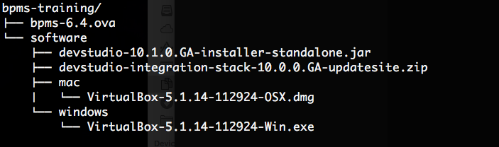
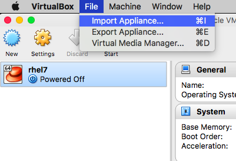
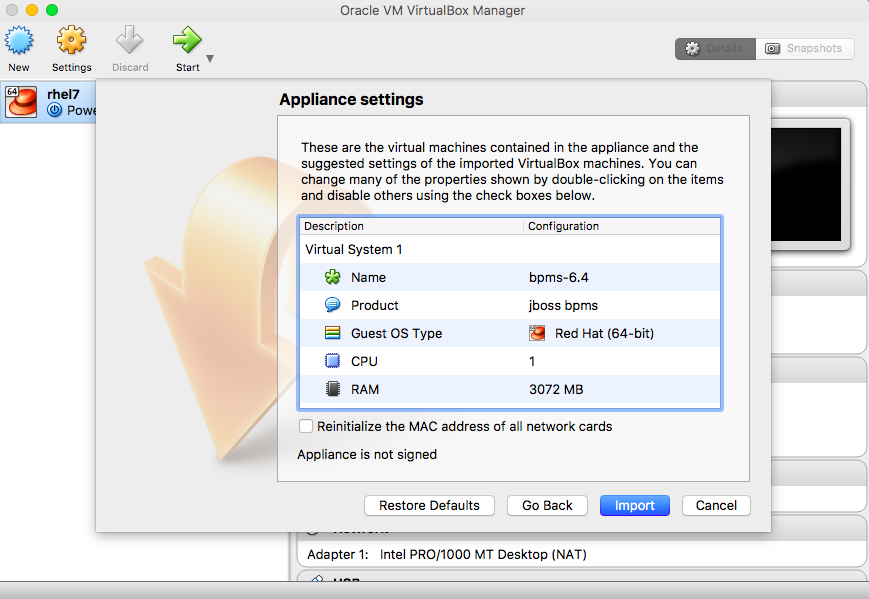
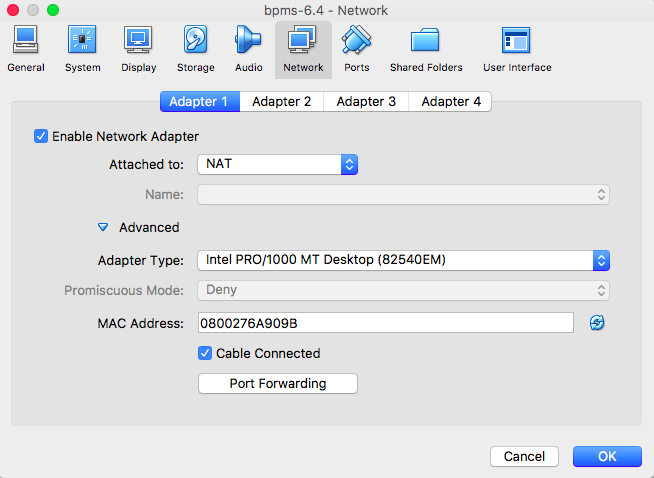
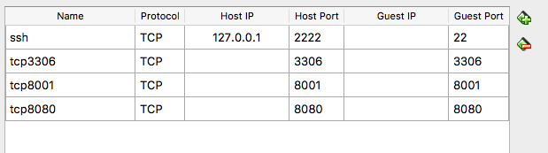
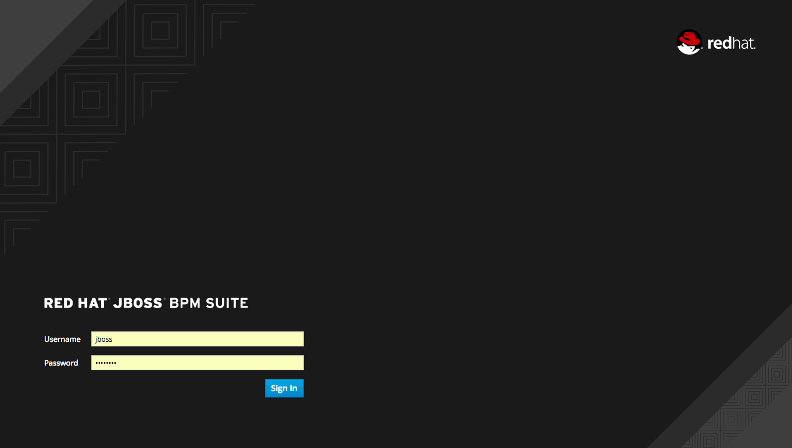
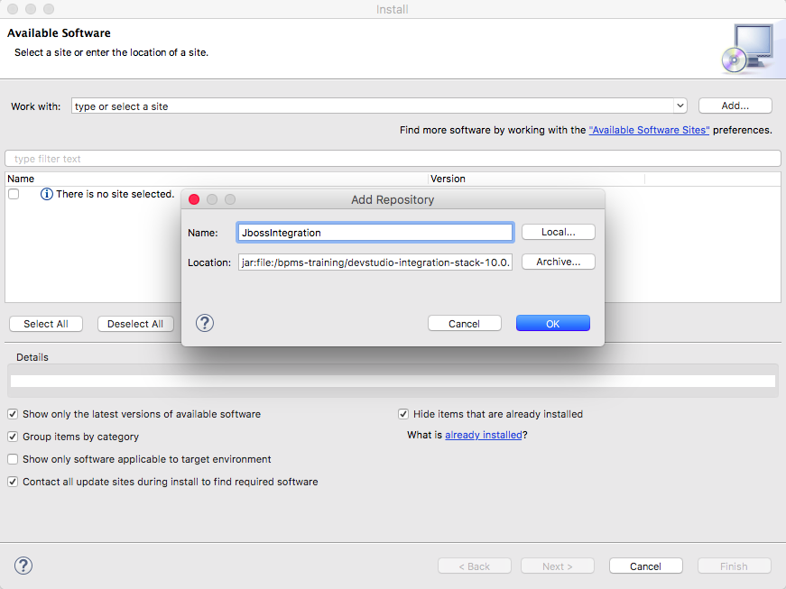
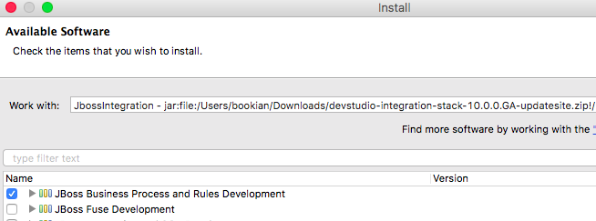

:icons: font
:toc: left

= Lab 0 - Lab Environment Setup

This training makes use of JBoss BPMS Server 6.4, as well as JBoss Developer Studio with JBoss Integration Stack.

== 1. JBoss BPMS Server

In order to get an environment up quickly, JBoss BPMS, along with its pre-requisites, has been installed and configured in a virtual machine. You can use an existing hypervisor that can import .ova virtual machines.

NOTE: Although you can use any hypervisor that can support .OVA images, the image is optimized and tested for Virtualbox. Therefore it is recommended that you use Virtualbox.

=== 1.1 Install Virtualbox

Installer for Virtualbox can be found in the `bpms-training/software` folder. Depending on your host OS, install Virtualbox by running the appropriate installer and follow the on screen instructions.

 +

Reboot the machine if necessary.

=== 1.2 Import BPMS-6.4 Virtual Machine 

Start virtualbox. From the menu, select `File -> Import Appliance...`

 +

At the `Appliance Settings` screen, you can change the RAM configuration if required. However, do not change any other settings.

 +

Click `Import` to start the import. It may take a few minutes to complete the import.

After installation is complete, open the virtual machine settings. Navigate to the Network settings, it should be similar to below diagram:

 +

Click on `Port Forwarding` button, and ensure that the following port forwarding settings are present:

 +

=== 1.3 Start BPMS Virtual Machine

Start the virtual machine by selecting it and click on `Start`.

Allow the machine to boot up. JBoss BPMS 6.4 has been configured to automatically start when the virtual machine is started. Using a modern browser such as Firefox or Chrome, navigate to the Business Central URL (http://localhost:8080/business-central) 

You should be greeted by the login screen.

 +

NOTE: It may take a few minutes for the BPM Suite to be deployed and ready. Please be patient.

Try login with the user `jboss` and password `Redhat1!`

== 2. JBoss Developer Studio

=== 2.1 JDK
You'll need a JDK to install JBoss Developer Studio. Go to http://www.oracle.com/technetwork/java/javase/downloads/jdk8-downloads-2133151.html to download a JDK suitable for your operating system.

=== 2.2 Install JBDS
Install JBoss Developer Studio by double-clicking on the installer JAR from Windows Explorer or MacOS Finder. 

Follow the on screen wizard to complete the setup.

Start JBoss Developer Studio. Choose a workspace location when prompted (for best performance, choose a local folder, do not use a network folder for workspace).

=== 2.3 JBoss Integration Stack
From JBoss Developer Studio, select `Help -> Install New Software...` from the menu. Click on `Add` to add the archive `devstudio-integration-stack-10.0.0.GA-updatesite.zip` (you can use any name, for example: JBossIntegration)

 +

Select `JBoss Business Process and Rules Development` tools from the avialable software and click `Finish`.

 +

Restart JBDS if necessary.

You now have the necessary tools installed to the training labs.

