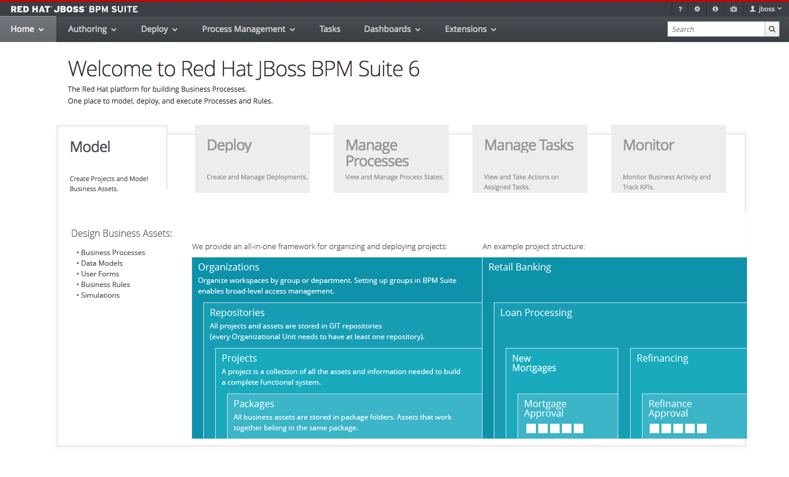
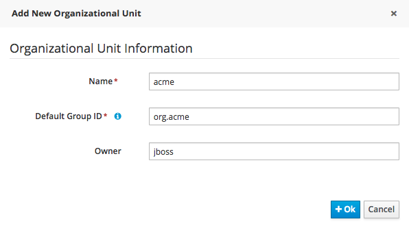
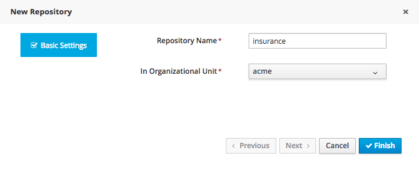
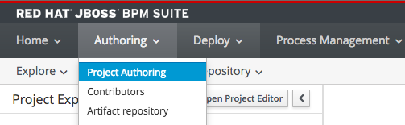
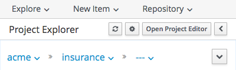
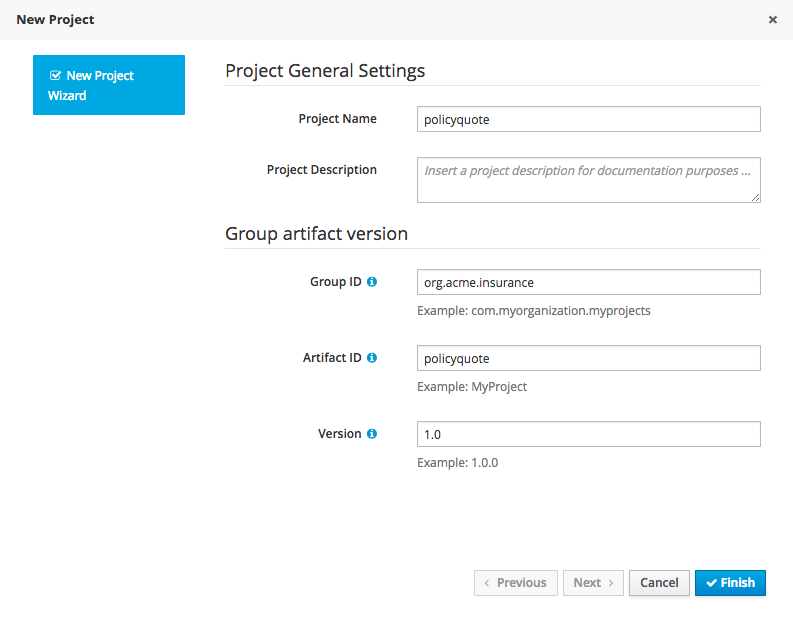

:icons: font
:toc: left

= Lab 1 - First Project

== Goal
Add the essential structure for Organization, Repository, and Project via the BPM Console of your BPM Suite environment.

== Pre-requisite
Complete BPM Suite Setup Lab

== 1. Log in
1. If necessary, restart BPM application if it is not running.

2. Open a browser and navigate to http://localhost:8080/business-central.

3. Log in with username `jboss` and password `Redhat1!`. The JBoss BPMS Suite 6 home page appears.
+

NOTE: It may take a few seconds for the workbench to load completely.

== 2. Add Organization Unit
In JBoss BPM Suite 6, assets are organized into organization units, repositories, and projects. First, you create an organization unit.

1. From the menu, select `Authoring -> Administration`

2. From `Organizational Units`, select `Manage Organizational Units`

3. From `Manage Organizational Unit` page, click on `+Add` button

4. On the popup screen that appears, enter the following:
* Name - `acme`
* Default Group ID - `org.acme`
* Owner - `jboss`
+
 +

5. Click `+Ok`

== 3. Create Repository
Next, you need to create or clone a BPM Git repository. JBoss BPM Suite 6 uses Git to provide the repository structure, so you can either clone an existing Git repository or create a new one. For this lab, create a new repository.

1. Click the Repositories link (next to Organizational Units on the administration page) and select New repository.
2. On the screen that appears, enter or select the following:
* Repository Name - `insurance`
* Organizational Unit - `acme`

 +
3. Click Finish.

[NOTE]
*What is a Repo?* +
The term _repo_ appears throughout the labs as well as official Red Hat documentation on BPM Suite 6. This is Red Hat’s short form of the term repository. However, the term can have various meanings depending on the context. Within JBoss BPM Suite 6 we use the following types of repos: +
*BPM Suite 6 Artifact Repository* +
Deployable BPM artifacts are retrieved from this artifact repository for deployment to the BPM server. In a BPM production environment, the artifact repository could be integrated with a remote Maven repo server such as Nexus. The default configuration (and the configuration used in this course) however is that the BPM artifact repository is co-located with the BPM Suite 6 server on its local filesystem. +
*Maven repos for BPM Suite 6* +
JBoss BPM Suite 6 includes both offline and online Maven repos that include supported BPM libraries (as opposed to community drools and jbpm libraries). Client side tooling (such as JBoss Developer Studio) are typically configured to reference the BPM Suite 6 maven repository so as to be able to build and unit test a BPM Suite 6 project. As part of the previous lab for module 1 of this course, you should have already configured your JBoss Developer Studio settings to reference either the offline or online BPM Suite 6 supported maven repo. +
*Git repos for BPM Suite 6* +
JBoss BPM Suite 6 uses a Git bare repo to version control its controlled assets. This repository is co-located with the JBoss BPM Suite 6 runtime at: /opt/bpms_data/bpms-repo/.niogit . This BPM Suite 6 specific repo can be cloned to your local environment via JBDS. When done so, a git enabled working project appears in your JBDS. BPM Suite 6 artifacts (such as rules and process definitions) can be modified in your local JBDS Those modifications can then be synced with the git bare repository used by BPM Suite 6.

== 4. Create Project

1. From main menu, select `Authoring -> Project Authoring`.
+
 
+
2. From the project explorer panel, select the `acme` organization and `insurance` repository.
+
 
+
3. From `New Item`, select `Project` and fill up the following project information:
* Project Name - `policyquote`
* Group ID - `org.acme.insurance`
* Artifact ID - `policyquote`
* Version - `1.0`
+

+
4. Click `Finish`.

Congratulations! You have successfully created your first git repository (insurance) to version control your rules / process definitions and you have also created your first mavenized BPM project (org.acme.insurance:policyquote:1.0).
