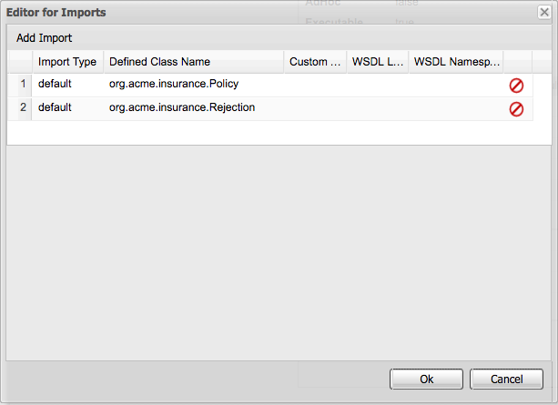
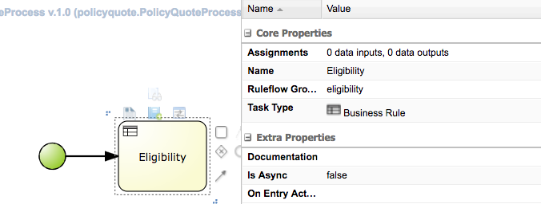
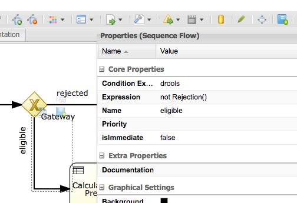
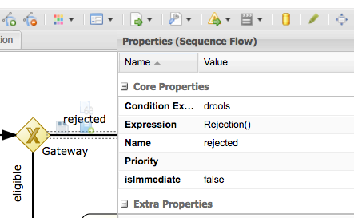
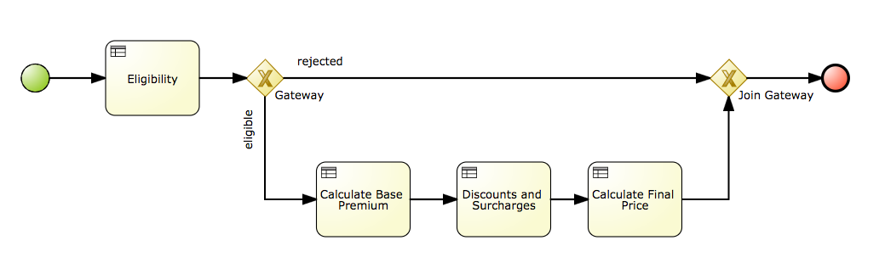
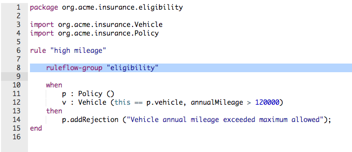
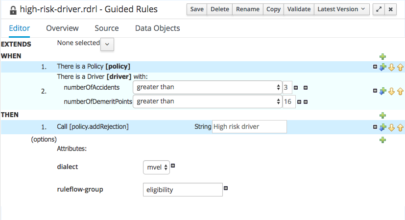

:icons: font
:toc: left

= Lab 10 - Ruleflows

We use `Ruleflows` to controll the order of rule execution. In this lab we'll build a ruleflow to first check the eligibility of policy quote request, and then compute the price of the policy.

== Goal
Learn to use the Process Designer to create a ruleflow.

== 1. Create New Business Process

1. On BPM console, select `Authoring -> Project Authoring`

2. Navigate to `org.acme.insurance.policyquote` package

3. Select `New Item -> Business Process`

4. Name the new business process as `PolicyQuoteProcess`

5. Click `OK`.

== 2. Set Properties and Imports

1. Open the properties pane by clicking on the `<<` button near the right edge of the process editor.

2. Verify that the ID of the process is set to `policyquote.PolicyQuoteProcess`

3. Click on the `Imports` dropdown.

4. On the screen that appears, click on `Add Import` to import the following:
+
- `org.acme.insurance.Policy`
- `org.acme.insurance.Rejection`
+
 +

5. Click `OK`

== 3. Add Start Node and Tasks

An event is something that happens during the course of a process. Events affect the flow of the process, usually have a cause or an impact, and generally require or allow for a reaction.
+
A task is an atomic activity in a BPMN2 process.

1. Click the `>>` button on the left edge of the editor canvas to bring out the `Object Library`.

2. Open the `Start Events` section and drag a `None` node onto the canvas.
+
NOTE: Skip this step if your diagram already has a start node.

3. Click in the `Start` node, observe the shortcut items appearing next to the start node:
+
 +

4. Click on the square with rounded corners to create a `Task`

5. Select the new task and open the properties pane by click on `<<` on the right edge.

6. Set the Name of the task to `Eligibility`, Task Type to `Business Rules` and Ruleflow Group to `eligibility`
+
 +

== 4. Create Conditional Business Flow 

1. Select the `Eligibility` task.

2. Click on `Data-based Exclusive` gateway  and drag it to the right of the `Eligibility` task.

3. On the `Properties` panel, for the `Exclusive Or` gateway name, enter `Gateway`.

4. Select the `Exclusive Or`, drag another `Data-based Exclusive` gateway to the right of it. Open the properties panel, name this gateway `Join Gateway`.

5. Drag an end event  to the right of the `Join Gateway`.

6. Now click on the first `Exclusive Or` gateway. Drag a task onto the canvas under the gateway.

7. Open the properties panel, set the Name of the task as `Calculate Base Premium`, Task Type as `Business Rules` and Ruleflow Group as `base-premium`

8. Click on the sequence line joining the first gateway to `Calculate Base Premium`.

9. Open the properties panel, set the following properties:
+
- Condition Expression Language : `Drools`
- Expression : `not Rejection()`
- Name : `eligible`
+
 +

10. For the sequence line between the 2 gateways, set the following properties:
+
- Condition Expression Language : `Drools`
- Expression : `Rejection()`
- Name : `rejected`
+
 +

== 5. Add Other Rule Tasks

1. Add an `Discounts and Surcharges` task with the following properties
+
- Name : `Discounts and Surcharges`
- Type : `Business Rules`
- Ruleflow Group : `discounts-and-surcharges`
+

2. Add a `Total` task with the following properties
+
- Name : `Calculate Final Price`
- Type : `Business Rules`
- Ruleflow Group : `final-price`
+
The completed ruleflow should look like this:
+
 +

== 6. Add Ruleflow Groups to Rules

We have created the `PolicyQuoteProcess` BPMN2 diagram and sequenced the Business Rules Tasks for different ruleflow groups. Now, we'll specify the `ruleflow-group` properties for each rule we've defined.

1. Navigate to `org.acme.insurance.eligibility` package. 

2. For the following DRL rules, add the ruleflow-group attribute with the value `eligibility`
+
- high-mileage
- maximum-age 
- minimum-age
- too-many-accidents
+

For example:
+
 +

3. For the following Guided Rules, add the ruleflow-group attribute with the `eligibility`
+
- high-risk-driver 
- maximum-value
- too-many-demerit-points
+

For example:
+
 +

4. Navigate to `org.acme.insurance.policyquote` package. Set the ruleflow group attributes each rule according to the table below:
+
[cols=3*, options="header,autowidth"]
|===
| | Rule Name | Ruleflow Group
|1| Experienced Driver Discount | discounts-and-surcharges
|2| Daytime Running Lights Discount | discounts-and-surcharges
|3| Young Driver Surcharge | discounts-and-surcharges
|4| Collision Base Premium | base-premium
|5| Comprehensive Base Premium | base-premium
|6| Calculate Base Premium | base-premium
|===
