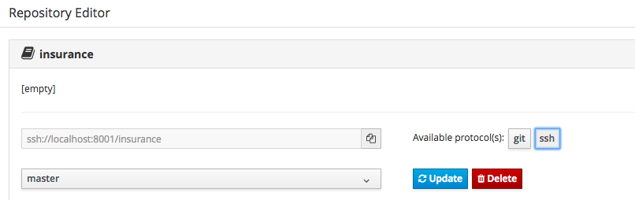
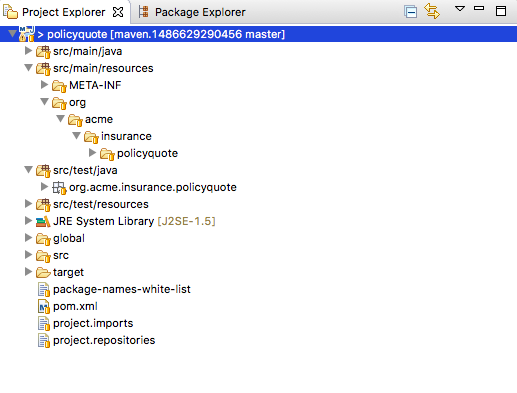

:icons: font
:toc: left

= Lab 2 - Knowledge Asset Management

== Goals
* Use JBoss Developer Studio to clone the `insurance` Git bare repo that was created in the previous module.
* Modify the content of the `insurance` Git repository via JBoss Developer Studio.
* Get a sense of the build and deploy workflow possibilities for JBoss BPM Suite 6 projects.

== Pre-requisites
Completed New Project Lab

== Overview

In this lab, we will clone the insurance quote project we created in the previous lab into the JBoss Developer Studio (JBDS). We will examine the directory structure of the project, and the artifacts created. 

Once the project is checked out, we'll make a few modifications and push the changes into the BPMS repository.

== 1. Check out project into JBoss Developer Studio
1. In Business Central, select `Authoring -> Administration`. This will bring you to the repository list.

2. Locate the `insurance` repository we created earlier, and click on `ssh` to see the ssh url of the git repository
+

+
This is the base Git url using SSH protocol. We can append a specific user by adding the `userid@` before the hostname. For example: `ssh://jboss@localhost:8001/insurance`

3. Start JBoss Developer Studio

4. Right click in the Project Explorer view and select `New -> Project`
+

+
5. In the New Project window, select the `Check out as Maven project with SCM` wizard
+

+
6. In SCM URL, select `git` and enter the SSH url from step 2 above (for example: `ssh://jboss@localhost:8001/insurance`). Remember to prepend the userid you use to connect to Business Central to the hostname.
+

+
7. Click `Finish`

8. Enter the password `Redhat1!` for user `jboss` when prompted
+

+
9. You may be asked to setup a Maven Plugin. Ignore this for now, and click `Finish`
+

+
10. When the wizard completes, the project will be checked out from Git
+

+
Take a few minutes to explore the directory structure and the generated artifacts.

== 2. Add a .gitignore file to the project
We have now cloned the Git repository and checked out the project. When working with build tools and IDEs such as Maven and Eclipse, we should exclude the tools generated artifacts from the Git repository. This can be done easily with a `.gitignore` file on the root directory of the project.

1. A default `.gitignore` file is generated when the Maven project is created. This is normally hidden in the project explorer view (along with all files with name beginning with a `.`). To show the `.gitignore` file, click on the small inverted triangle in the project explorer view and select `Customize View`
+

+
2. Uncheck the `.* resources` filter and click `Ok`
+

+
3. The `.gitignore` file should now be visible from the project explorer. Edit the file with the content below 
+
----
.metadata 
bin/
tmp/
target/
.settings/
.externalToolBuilders/
*.tmp
*.bak
*.swp
.loadpath
.recommenders
.project
.classpath
.target
----
4. Open the Git Staging view by selecting `Windows -> Show View -> Others`
+

+
The Git Staging view will be activated. The `.gitignore` file will appear under the Unstaged Changes section. (If it's not there, click of `Refresh` button). Right click on the file and select `Add to Index`. This will put the file under source control. 
+

+
Finally, put in a commit message and then click `Commit and Push...` to push the changes to BPM server.
+

+
A popup window will appear. Click `Ok` to complete the operation.

== 3. View commit in Business Central

Complete this lab by confirming that the commit that includes the new .gitignore file is viewable in the BPM Console of BPMS Suite 6.

1. Return to your browser to authenticate back into the BPM Console of your remote BPM Suite 6 container.

2. Navigate to `Authoring -> Administration`

3. In the File Explorer panel to the left, drill down to `Repositories -> insurance`

4. Notice the latest commit message (previously created in JBDS) in the Commit History panel
+

