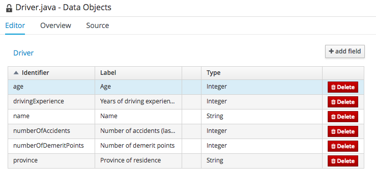
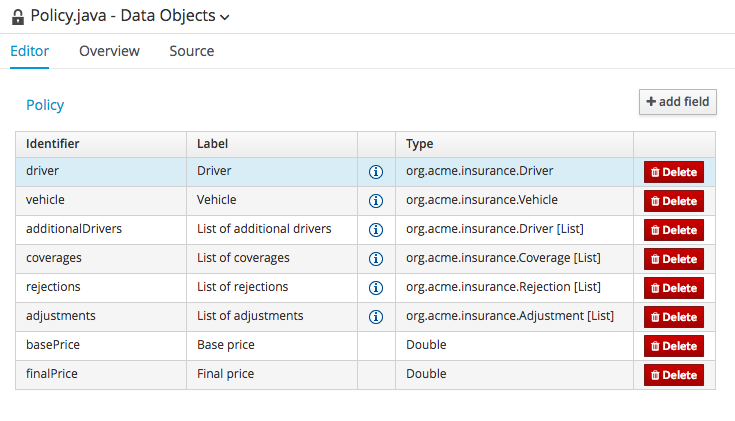

:icons: font
:toc: left

= Lab 3 - Data Modeler

Business rules and processes act on business objects. Business analysts and developers can use the Data Modeler in the BPMS workbench to create the object model that will be used to express business rules and processes.

== Goals
In this lab, we'll use the Data Modeler to create the data model that will be used for rules processing and process execution in subsequent labs.

== 1. Data Modeler

1. Login to BPMS workbench as user `jboss` and password `Redhat1!`.

2. Select `Authoring -> Project Authoring` from the main menu, and select the `policyquote` Project. Navigate to the package `org.acme.insurance`
+
 +
We will create our object model in this package.

3. Select `New Item -> Data Object` from the menu +
 +
and fill in the following: +
* Data Object - Driver
* Package - org.acme.insurance
* Leave `Persistable` unchecked +
and click `OK` + 
 +

4. From the editor click on `Add Field` + 
 +
and create a field as follow: +
* Identifier - name
* Label - Name
* Type - String
* Leave `List` unchecked +
and click `Create` +

5. Observe that the `name` field is created for the `Driver` object +

== 2. Create other fields

1. Using the same steps, create the other fields for the Driver object 
+
[cols=3*, options="header,autowidth"]
|===
| Identifier | Label | Type
| age | Age | Integer
| drivingExperience | Years of driving experience | Integer
| numberOfAccidents | Number of accidents (last 3 years) | Integer
| numberOfDemeritPoints | Number of demerit points | Integer
| province | Province of residence | String
|===
+
TIP: You can use the `Create and continue` button to create multiple fields quickly
+
2. Upon completion, the Driver object should look like this
+
 +
+
3. Click of `Save` to save the completed object.

== 3. Create other objects

1. Create `Vehicle` object in the same package (`org.acme.insurance`) with the following fields
+
[cols=3*, options="header,autowidth"]
|===
| Identifier | Label | Type
| hasDaytimeRunningLights | Has daytime running lights | Boolean
| make | Make | String
| marketValue | Market value | Integer
| yom | Year of manufacture | Integer
| annualMileage | Annual mileage | Integer
|===

2. Create `Coverage` object in the same package (`org.acme.insurance`) with the following fields
+
[cols=3*, options="header,autowidth"]
|===
| Identifier | Label | Type
| type | Type | String
| excess | Excess | Integer
| limit | Limit | Integer
| premium | Premium | Double
|===

3. Create `Rejection` object in the same package (`org.acme.insurance`) with the following fields
+
[cols=3*, options="header,autowidth"]
|===
| Identifier | Label | Type
| reason | Reason| String
|===

4. Create `Adjustment` object in the same package (`org.acme.insurance`) with the following fields
+
[cols=3*, options="header,autowidth"]
|===
| Identifier | Label | Type
| type | Type| String
| unit | Unit | String
| amount | Amount | Double
| description | Description | String
|===
+
5. So far the objects created uses Java primitive types. As you may have noticed from the UI, a field can also be a complex object and/or a collection (list). Now, create the `Policy` object. It will have a vehicle and a primary driver
+
[cols=3*, options="header,autowidth"]
|===
| Identifier | Label | Type
| vehicle | vehicle| org.acme.insurance.Vehicle
| driver | driver | org.acem.insurance.Driver
|===
+
6. In addition, the there maybe zero or more additional drivers. Create a field `additionalDrivers` which is a `List` of `Drivers` (ensure you check the `List` checkbox):
+
 +

7. Similarly, create the list fields for coverages, rejections and adjustments
+
[cols=3*, options="header,autowidth"]
|===
| Identifier | Label | Type
| coverages | List of coverages | org.acme.insurance.Coverage [List]
| rejection | List of rejections | org.acme.insurance.Rejection [List]
| adjustment | List of adjustments | org.acme.insurance.Adjustment [List]
|===
+
Complete the `Policy` object with the following fields
+
[cols=3*, options="header,autowidth"]
|===
| Identifier | Label | Type
| basePrice | Base price | Double
| finalPrice | Final price | Double
|===

When completed, the Policy object should look like this:
+
 +
+
NOTE: Remember to `Save` all the objects you've create.

8. At this point, six (6) object are created. Select any one of them and click you `Source` on the editor panel. You will see that Java code is generated for the objects we've created
+
 +

Congratulations, you have successfully created the object model using the Data Modeler. These objects will be used in our rules and processes in following labs. 
