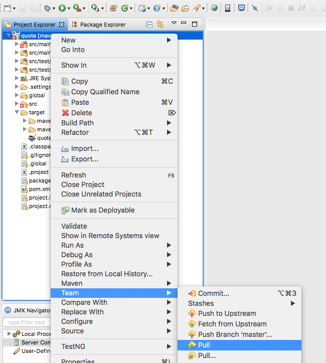
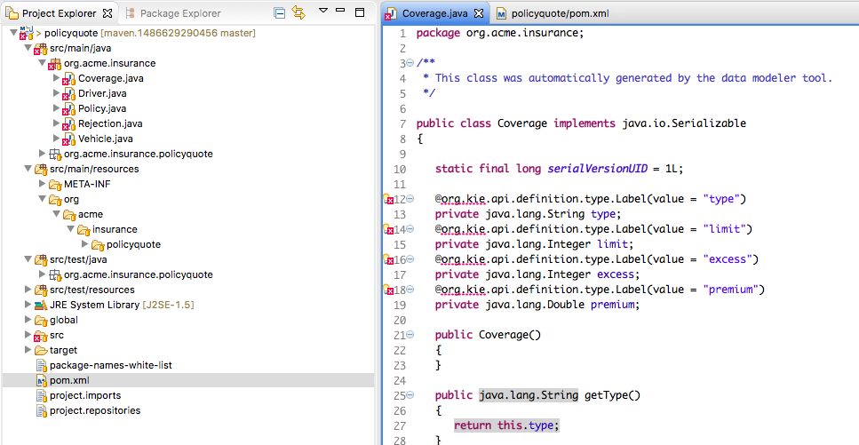
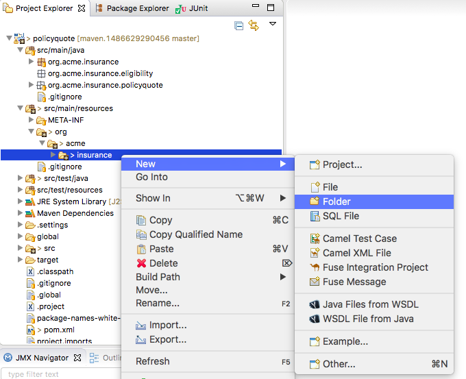
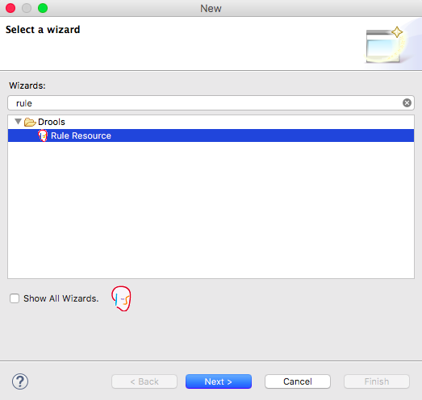
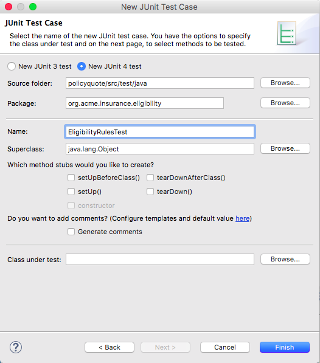
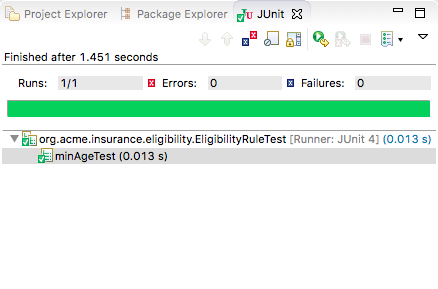
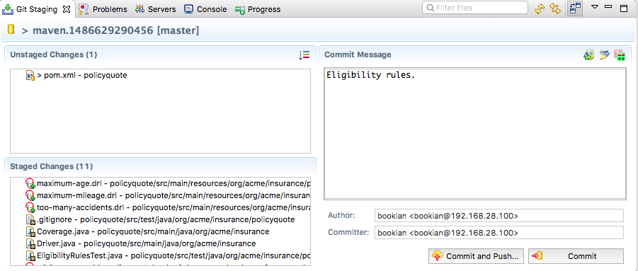
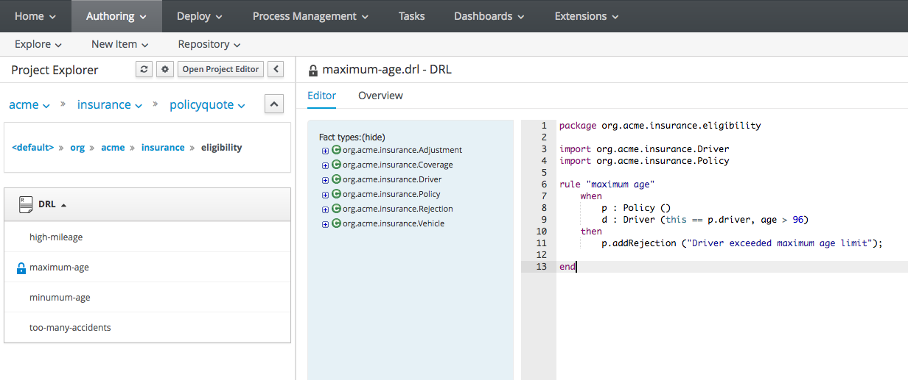

:icons: font
:toc: left

= Lab 4 - DRL Rules

In the previous lab we created a data model in BPMS Workbench's Data Modeler. Now, we'll pull the data model into JBDS and write our first DRL rules.

== Goals
Create a set of rules to determine the eligibility for a car policy.

== 1. Pull Data Model Into JBDS

In this lab, a set of rules will be created in JBoss Developer Studio. These rules references the object model we created in the previous lab, so we need to first pull the object model from the BPMS Git repository into the local environment.

1. In JBoss Developer Studio, right click on the quote project and select `Team -> Pull`
+
 +

2. Click `OK`

3. When the operation completes, the objects `Coverage`, `Driver`, etc will be available in the project view. There may be errors identified by the JBDS. This is normal, we will fix it in the next steps.
+
 

== 2. Add KIE-API and JUnit Dependencies

The errors we see earlier are due to the missing dependencies for the Drools (KIE) APIs. We'll add the dependency using the POM file. We'll also add dependency for JUnit so we can run some unit tests for our rules.

1. In JBDS, navigate to quote/pom.xml file. Open it, and switch to the `pom.xml` view (using the tabs at the bottom of the editor)
2. Replace the content with this link:extras/lab4/pom.xml[pom.xml]
+
[source,xml]
----
<?xml version="1.0" encoding="UTF-8"?>
<project
	xsi:schemaLocation="http://maven.apache.org/POM/4.0.0 http://maven.apache.org/xsd/maven-4.0.0.xsd"
	xmlns="http://maven.apache.org/POM/4.0.0" xmlns:xsi="http://www.w3.org/2001/XMLSchema-instance">
	<modelVersion>4.0.0</modelVersion>
	<groupId>org.acme.insurance</groupId>
	<artifactId>policyquote</artifactId>
	<version>1.0</version>
	<packaging>kjar</packaging>
	<name>policyquote</name>

	<properties>
		<kie-version>6.5.0.Final-redhat-2</kie-version>
		<junit-version>4.11</junit-version>
	</properties>

	<dependencies>
		<dependency>
			<groupId>org.kie</groupId>
			<artifactId>kie-api</artifactId>
			<version>${kie-version}</version>
		</dependency>
		<dependency>
			<groupId>org.drools</groupId>
			<artifactId>drools-compiler</artifactId>
			<version>${kie-version}</version>
		</dependency>
		<dependency>
			<groupId>junit</groupId>
			<artifactId>junit</artifactId>
			<version>${junit-version}</version>
			<scope>test</scope>
		</dependency>
	</dependencies>

	<repositories>
		<repository>
			<id>guvnor-m2-repo</id>
			<name>Guvnor M2 Repo</name>
			<url>http://localhost:8080/business-central/maven2/</url>
		</repository>
	</repositories>
	<build>
		<plugins>
			<plugin>
				<groupId>org.kie</groupId>
				<artifactId>kie-maven-plugin</artifactId>
				<version>${kie-version}</version>
				<extensions>true</extensions>
			</plugin>
		</plugins>
	</build>
</project>
----
3. Review the updated pom.xml content, notice the inclusion of kie-api and junit dependencies.
4. Save the modifiled pom.xml. This will trigger a background rebuild of the project (if automatic build is disabled, trigger a build manually using `Project->Build All` menu option). When the build is completed, all the errors we see earlier should be eliminated.

== 3. Update Model Classes

The base Java code for our object model was generated by the Data Modeler in BPMS Workbench. We can also update the Java classes directly using JBoss Developer Studio. Here we'll add some helper methods to the classes.

1. Open the `Adjustment` class and add the `toString` method as follow:
+
[source,java]
----

	@Override
	public String toString() {
		StringBuilder builder = new StringBuilder();
		builder.append("Adjustment [type=")
				.append(type)
				.append(", unit=")
				.append(unit)
				.append(", amount=")
				.append(amount)
				.append(", description=")
				.append(description)
				.append("]");
		return builder.toString();
	}
----
+
TIP: If you are familiar with Eclipse/JBDS, you can use `Source -> Generate toString()...` to generated the method.

2. Similarly, add the `toString` methods for the `Coverage` class
+
[source,java]
----
	@Override
	public String toString() {
		StringBuilder builder = new StringBuilder();
		builder.append("Coverage [type=")
				.append(type)
				.append(", limit=")
				.append(limit)
				.append(", excess=")
				.append(excess)
				.append(", premium=")
				.append(premium)
				.append("]");
		return builder.toString();
	}
----

3. Add the `toString` methods for `Driver`
+
[source,java]
----
	@Override
	public String toString() {
		StringBuilder builder = new StringBuilder();
		builder.append("Driver [name=")
				.append(name)
				.append(", drivingExperience=")
				.append(drivingExperience)
				.append(", numberOfAccidents=")
				.append(numberOfAccidents)
				.append(", numberOfDemeritPoints=")
				.append(numberOfDemeritPoints)
				.append(", age=")
				.append(age)
				.append(", province=")
				.append(province)
				.append("]");
		return builder.toString();
	}
----

4. Add `toString` to `Rejection`
+
[source,java]
----
	@Override
	public String toString() {
		StringBuilder builder = new StringBuilder();
		builder.append("Rejection [reason=")
				.append(reason)
				.append("]");
		return builder.toString();
	}
----

5. Add `toString` to `Vehicle`
+
[source,java]
----
	@Override
	public String toString() {
		StringBuilder builder = new StringBuilder();
		builder.append("Vehicle [hasDaytimeRunningLights=")
				.append(hasDaytimeRunningLights)
				.append(", make=")
				.append(make)
				.append(", marketValue=")
				.append(marketValue)
				.append(", yom=")
				.append(yom)
				.append(", annualMileage=")
				.append(annualMileage)
				.append("]");
		return builder.toString();
	}
----

6. Add `toString` to `Policy`
+
[source,java]
----
	@Override
	public String toString() {
		StringBuilder builder = new StringBuilder();
		builder.append("Policy [driver=")
				.append(driver)
				.append(", vehicle=")
				.append(vehicle)
				.append(", additionalDrivers=")
				.append(additionalDrivers)
				.append(", coverages=")
				.append(coverages)
				.append(", rejections=")
				.append(rejections)
				.append(", adjustments=")
				.append(adjustments)
				.append(", basePrice=")
				.append(basePrice)
				.append(", finalPrice=")
				.append(finalPrice)
				.append("]");
		return builder.toString();
	}
----

7. In addition, we will add a few helper methods to the `Policy` class
+
[source,java]
----
	// note: add 
	//   import java.util.ArrayList;
	// in order to compile.

	public Rejection addRejection(String reason) {
		if (null == rejections) {
			rejections = new ArrayList<Rejection>();
		}
		Rejection r = new Rejection(reason);
		rejections.add(r);
		return r;
	}
	
	public Adjustment addDiscount(String unit, Double amount, String description) {
		return addAdjustment("discount", unit, amount, description);
	}

	public Adjustment addSurcharge(String unit, Double amount, String description) {
		return addAdjustment("surcharge", unit, amount, description);
	}
	
	public Adjustment addAdjustment(String type, String unit, Double amount, String description) {
		if (null == adjustments) {
			adjustments = new ArrayList<Adjustment>();
		}
		Adjustment adj = new Adjustment(type, unit, amount, description);
		adjustments.add(adj);
		return adj;
	}
----
+
The completed `Policy` class can be found link:extras/lab4/Policy.java[here].

== 4. DRL Rule Structure

DRL is a language used to express business rules in JBoss BRMS/BPMS. DRL typically consist of a package definition, import statement(s), and the rule definition. A DRL rule definition consists of a condition (`when`) block and an action (`then`) block.
[cols=2*, options="header,autowidth"]
|===
| Rule Element | Description
| package | An organizational concept that is equivalent to a Java package.
| import | As in a Java class, you must import the dependent classes used in your rule.
| rule | Every rule needs a name that is unique within a package.
| when | This is where conditions are described.
| then | This section contains the actions to be taken when the conditions in the `when` section were met.
|===

== 5. First Business Rule

We will now write a few rules to determine the driver is eligible for insurance coverage. We will first create a package named `eligibility` for all eligibility rules, followed by a simple rule to reject policy application where the age of the driver is less then 17.

1. Create eligibility resource folder. On the JBDS Project Explorer, right click on `src/main/resources/ -> org/acme/insurance` and select `New -> Folder`
+
 +
+
In the new New Foler dialog, enter `eligibility` for folder name and click `Finish`.

2. Create a minimum age rule to reject a policy application when the driver for the policy does not meet the minimum age requirement of 17 years old. +
Right click on the newly created `eligibility` folder and click `New -> Other` to create a new `Rule Resource`.
+
 +

3. Create new rule file with the following information: +
* File name : minimum age
* Type of rule resource : New Rule (individual rule)
* Rule package name : org.acme.insurance.eligibility
+
image:images/lab4_5_min_age.png[] +

4. Replace the content of `minimum-age.drl` with the following: +
+
----
package org.acme.insurance.eligibility

import org.acme.insurance.Driver
import org.acme.insurance.Policy

rule "minimum age"
    when
        p : Policy ()
        d : Driver (this == p.driver, age < 17)
    then
        insert ( p.addRejection ("Driver does not meet minimum age requirement") );

end
----

== 6. Create Unit test

1. In the project explorer of JBDS, navigate to `src/test/java`.

2. Right click on `org.acme.insurance.eligibility` and create a new JUnit test case. +
* Source folder : policyquote/src/test/java
* Package : org.acme.insurance.eligibility
* Name : EligibilityRulesTest
+
 +

3. Replace the content of the JUnit test class with the following:
+
[source,java]
----
package org.acme.insurance.eligibility;

import static org.junit.Assert.assertEquals;

import org.acme.insurance.Driver;
import org.acme.insurance.Policy;
import org.acme.insurance.Vehicle;
import org.junit.AfterClass;
import org.junit.BeforeClass;
import org.junit.Test;
import org.kie.api.KieBase;
import org.kie.api.KieServices;
import org.kie.api.logger.KieRuntimeLogger;
import org.kie.api.runtime.KieContainer;
import org.kie.api.runtime.KieSession;
import org.kie.api.runtime.rule.FactHandle;

public class EligibilityRulesTest {

	static KieBase kbase;
	static KieSession ksession;
	static KieRuntimeLogger klogger;

	@BeforeClass
	public static void setupKsession() {
		try {
			// load up the knowledge base and create session
			ksession = readKnowledgeBase();
			System.out.println("setupKsession() ksession  = " + ksession);
			klogger = KieServices.Factory.get().getLoggers().newFileLogger(ksession,
					"src/test/java/org/acme/insurance/policyquote/eligibility");
		} catch (Throwable t) {
			t.printStackTrace();
		}
	}

	@Test
	public void minAgeTest() {
		// now create some test data
		Driver driver = new Driver();
		driver.setAge(16);

		Vehicle vehicle = new Vehicle();
		
		Policy policy = new Policy();
		policy.setDriver(driver);
		policy.setVehicle(vehicle);

		// insert objects into working memory
		FactHandle policyFH = ksession.insert(policy);
		FactHandle driverFH = ksession.insert(driver);
		FactHandle vehicleFH = ksession.insert(vehicle);

		ksession.fireAllRules();

		System.out.println(policy);
		assertEquals(policy.getRejections().size(), 1);
		
		ksession.delete(policyFH);
		ksession.delete(driverFH);
		ksession.delete(vehicleFH);
	}

	@AfterClass
	public static void closeKsession() {
		try {
			// closing resources
			klogger.close();
			ksession.dispose();
		} catch (Throwable t) {
			t.printStackTrace();
		}
	}

	private static KieSession readKnowledgeBase() throws Exception {
		KieServices ks = KieServices.Factory.get();
		KieContainer kContainer = ks.getKieClasspathContainer();
		KieSession kSession = kContainer.newKieSession();
		return kSession;
	}
}
----
+
and save the changes.

4. On the Project Explorer, right click on `EligibilityRulesTest.java` and select `Run As -> JUnit Test`. Review the JUnit view, the unit test should pass.
+
 

== 7. More Eligibility Rules

Now, try to write a few more eligibility rules and unit test using the `minimum-age` rule above as a reference.

1. Reject policy if the driver's age is over 96 years old
2. Reject policy if the driver has more then 5 accidents 
3. Reject policy if the vehicle's yearly mileage is more then 120,000 KM

== 8. Commit and Push Changes

In this lab, we have made changes to the object classes, and authored 4 DRL rules. With the exception of `pom.xml`, we'll commit and push these changes and addition to the BPMS server.

1. Right click on the `policyquote` project in the project explorer and select `Team -> Commit`.

2. Right click the new and changed files created and click `Add to Index`. Do not select `pom.xml`.
+
IMPORTANT: Make sure you do not commit and push the modified pom.xml file to your lab environment. In JBoss BPM Suite.*, the business-central.war file cannot handle projects that include a pom.xml file with Drools, KIE, UberFire, or jbpm dependencies defined in it.

3. Enter a commit message, and click `Commit and Push`.
+
 

4. Open the BPMS Workbench from a browser, and select `Authoring -> Project Authoring`. Navigate to the  `org.acme.insurance.eligibility` package. You should see the DRL rules you've just pushed from the Developer Studio.
+

Congratulations, you have successfully created helper methods in object model and written your first DRL rules!

