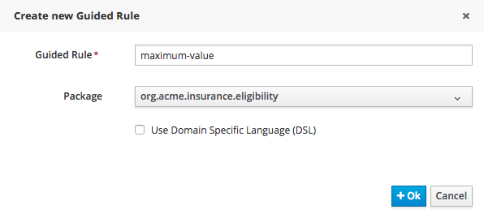
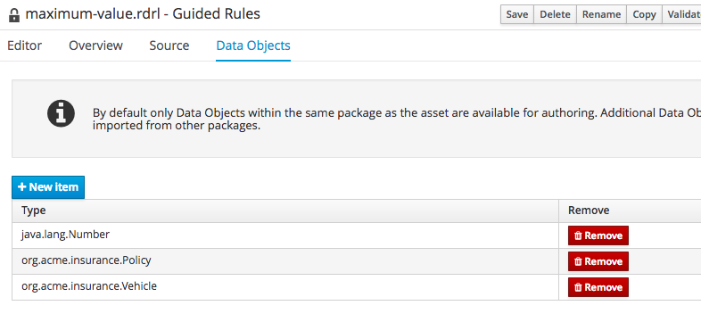
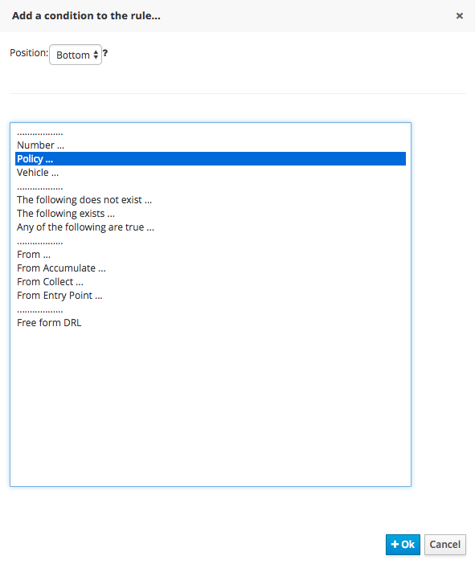

:icons: font
:toc: left

= Lab 5 - Guided Rule Editor

== Goals
In this lab, we'll create more rules using the BPM Suite's Guided Rule Editor.

== 1. Maximum Value Rule

1. First, create a rule that rejects a policy quote when the value of the vehicle exceeds $500,000. In the BPM Suite Project Explorer, navigate to the `org.acme.insurance.eligibility` package.
+
 +

2. Select `New Item -> Guided Rule`.

3. Create new guided rule with the following information. +
* Guided Rule : maximum-value
* Package : org.acme.insurance.eligibility
* Do *not* check Use Domain Specific Language (DSL)
+
 +

4. Like DRL from previous lab, first we import the objects we need in our rule. In the editor pane, click on `Data Objects` tab, and click `New Item`, and add `org.acme.insurance.Policy`
+
 +

5. Add condition for rule by clicking on the `+` icon to the right of `When`, select `Policy` and click `OK`
+
 +

6. Click on `There is a Policy`+
+
 +

7. Add `vehicle` restriction to the field
+
image:images/lab5_6_vehicle_constraint.png[] +

8. Click on `There is a Policy` again and set the variable name to `policy`, and click `Set`.
+
 +

9. Now we want to access the `marketValue` field of the `vehicle`. To do that, click on `vehicle` in the guided rule editor. In the resulting pop-up, click on `Show sub fields` and select `marketValue`.
+
image:images/lab5_8_show_sub_fields.png[]
+
The rule editor now look like this:
+
image:images/lab5_9_guided_rule_partial.png[] 

10. Click on the drop down next to marketValue and select `greater than`.

11. Click on the pencil icon next to `greater than` and select `Literal Value`. A small text box now appears in place of the icon. Enter the value `5000000` in the text box.
+
image:images/lab5_10_conditions_done.png[] 

12. Click on the `+` icon to the right of `Then`, and select `Call method on policy...`
+
 +

13. Select the `addRejection` method, and `Literal value` for string parameter. Enter a rejection reason, such as `Vehicle value exceeds maximum allowed for online quote`. The completed rule should look like this:
+
image:images/lab5_12_completed.png[] +

14. Click on the `Source` tab, and you'll see that the generated source is actually a DRL.
+
image:images/lab5_13_source.png[] +

== 2. Too Many Demerit Points Rule

1. Create an eligibility rule where drivers with too many demerit points will be rejected.
+
[cols=2*, options="autowidth"]
|===
| *condition* | the driver of in the policy has more than 20 demerit points 
| *action* | add rejection with reason 'Driver has too many demerit points'
|===

== 3. High Risk Driver Rule

1. Create an eligibility rule with multiple conditions.
+
[cols=2*, options="autowidth"]
|===
.2+| *condition* | 1. the driver has more than 3 accidents 
| 2. the driver has more than 16 demerit points
| *action* | add rejection with reason 'High Risk Driver'
|===
