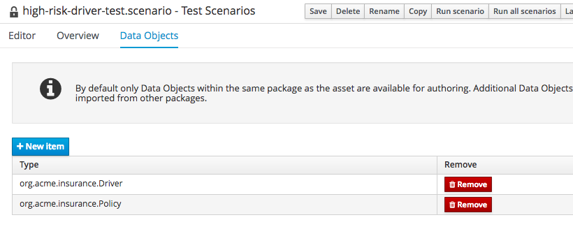
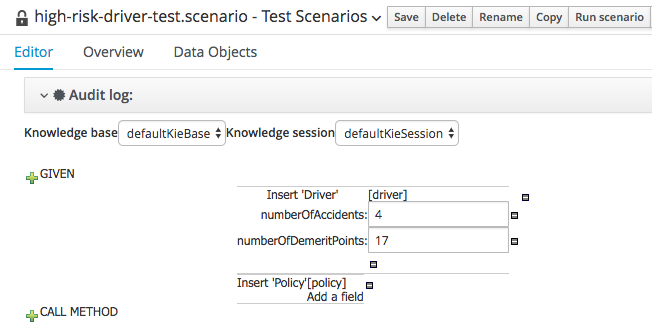
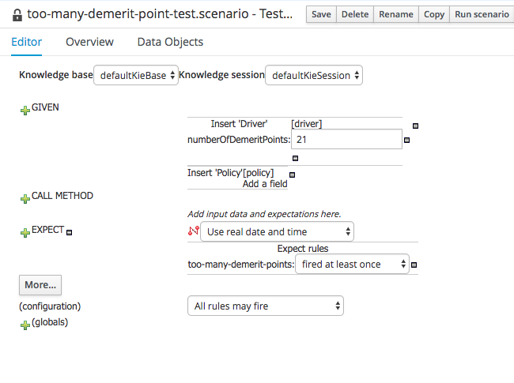
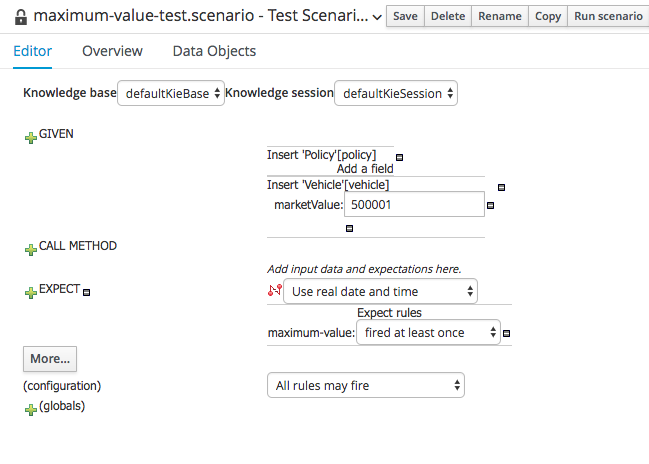

:icons: font
:toc: left

= Lab 6 - Test Scenario

When developing rules using the JBoss Developer Studio, we use JUnit to unit test rules. On the BPM Suite Workbench, we can create Test Scenarios for the same purpose. In this lab, we'll create test scenarios for the guided rules we created in the previous lab.

== Goal

Create test scenarios using BPM Suite.

== 1. High Risk Driver Test

1. In the `org.acme.insurance.eligibility` package, select `New Item -> Test Scenario`
+
 +

2. Just like Guided Rules, we first import the objects required for the test. From the `Data Objects` tab, click on `New Item` and add `org.acme.insurance.Policy`
+
 +

3. Switch back to `Editor` tab. Click on the `+` icon beside `Given` and add a `Policy` fact, with the name `policy`, and a `Driver` fact with the name `driver`
+
 +
+
image:images/lab6_4_new_input_2.png[] +

4. Click on `Add a field` under the `driver` and add `driver`
+
image:images/lab6_5_add_driver.png[] +

5. Now we add constraints to the `driver` object. Click on `Insert Driver` and add the fields `numberOfAccidents` and `numberOfDemeritPoints`
+
 +

6. Click on pencil icon next to the `numberOfAccidents` and select `Literal` value. Do the same for `numberOfDemeritPoints`. Fill in the values 4 for `numberOfAccidents` and 17 for `numberOfDemeritPoints`.
+
 +

7. Run the test scenario by clicking on `Run scenario` button near the top of the editor window. You should see the test completed successfully, and that 1 rule was fired. Click on `Show rules fired`, and you should see that the `high-risk-driver` rule was fired.
+
 +

8. Inspecting the rules fired is fine for adhoc tests. For automation, we should specify the expected outcome(s) of the test. Click on `+` beside `EXPECT` and add `high-risk-driver` rule.
+
image:images/lab6_10_add_expectation.png[] +

9. Now, change the `numberOfDemeritPoints` to `16` and run the test scenario again. You should see a test failure:
+
 +
+
Take a minute to observe the outcome (error messages) of the test. 

10. Change the `numberOfDemeritPoints` to `17` and `Save` the test scenario.

== 2. Too Many Demerit Points Test

1. Now follow the steps above and create suitable test scenario for `too-many-demerit-points` rule.
+
TIP: You can make a copy of the `high-risk-driver-test` and modify it for `too-many-demerit-points` test.
+
 +

== 3. Maximum Value Test

1. Now follow the steps above and create suitable test scenario for `maximum-value` rule.
+
 +

Congratulations! You have successfully create test scenarios for your rules!

