:icons: font
:toc: left

= Lab 7 - Decision Tables

Decision tables are rules presented in a tabulated form, like a spreadsheet. This format is especially useful when needing to create lots of rules that are similar in nature. +
BPM Suite supports decision tables written in a spreadsheet (Excel, OpenOffice), as well as a web-based *Guided Decision Table Editor*. In this lab, you will use the web-based decision table editor to author rules

== Goal

Use the Guided Decision Table to implement decision table rule.

== 1. Create New Decision Table

We will use decision tables to create pricing tables for various types of coverage. The premium for each coverage type will be based on the limit and excess requested.

1. In BPM Suite, navigate to the `org.acme.insurance.policyquote` package.
+
image:images/lab7_1_package.png[] +

2. Select `New Item -> Guided Decision Table` to create a new decision table with the following inputs:
* Table name : `Comprehensive Base Premium`
* Package : `org.acme.insurance.policyquote`
* Check `Extended entry, values defined in table body`
+
image:images/lab7_2_new_decision_tbl.png[] +

3. Import the `Coverage` object
+
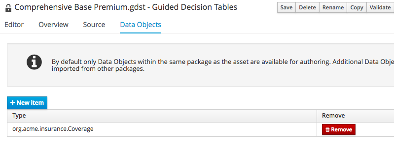 + 

== 2. Create Conditions
1. Switch back to `Editor` tab. Expand `Decision Table` and click on `New column`
+
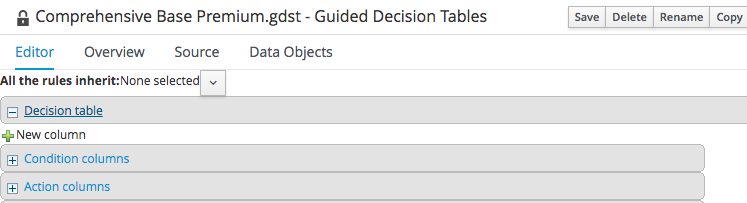 +

2. Add a simple condition
+
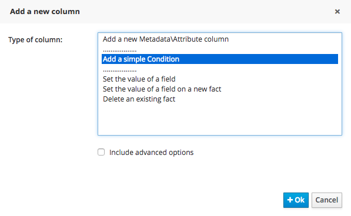 +
and add a `Coverage` fact
+
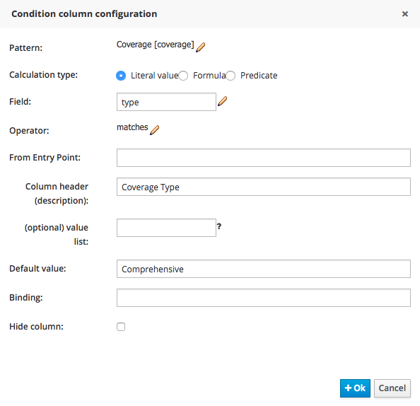 +

3. Add other conditions
+
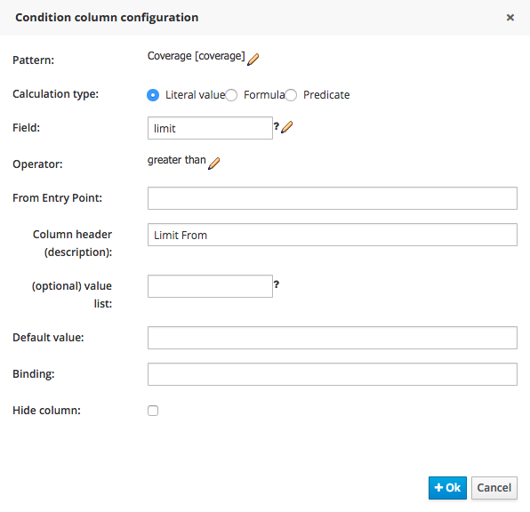 +
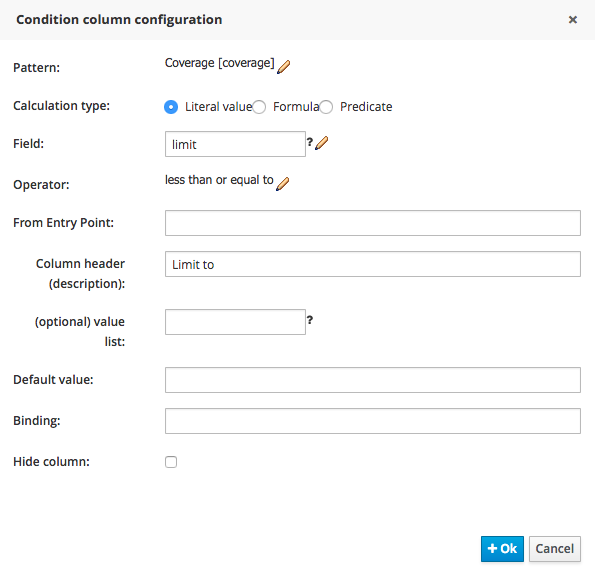 +
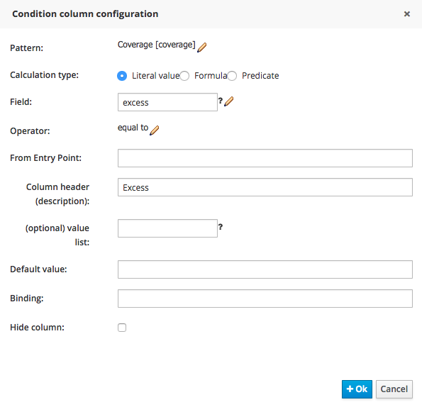 +

== 3. Create Action
1. Add action by selecting `Set the value of a field`
+
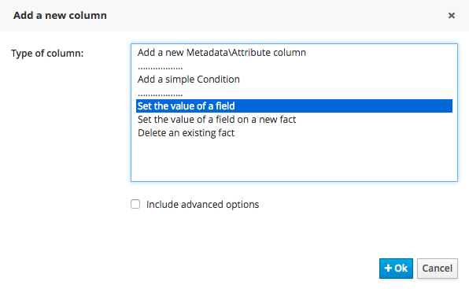 +
+
And populate the action field as follow: 
+
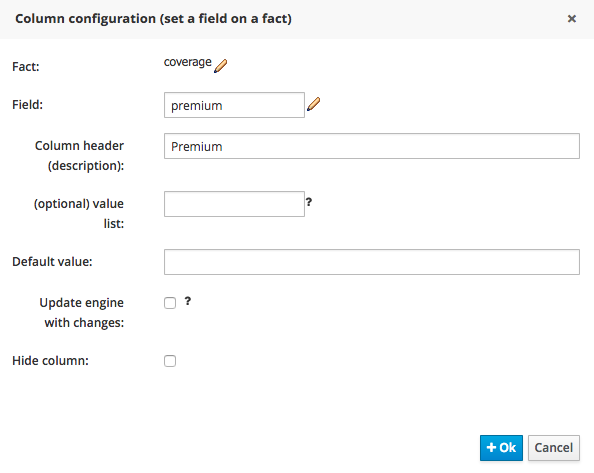 +

2. At this point we have the columns defined.
+
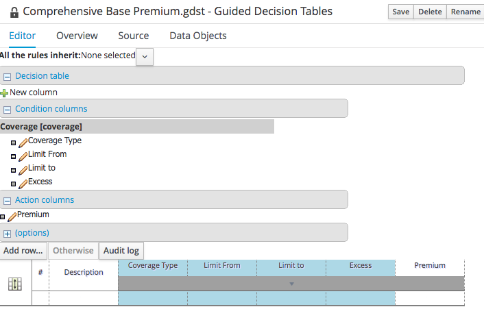 +

== 4. Populate Table
1. Click on `Add row...` and populate the table as follows:
+
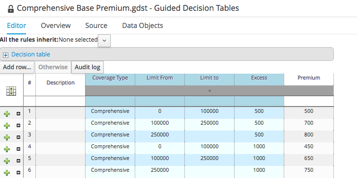 +

2. Click on `Source` tab, and you can see that each row in the decision table is translated into a DRL rule. Take a few minutes to see how the rules correspond to the decision table entries.
+
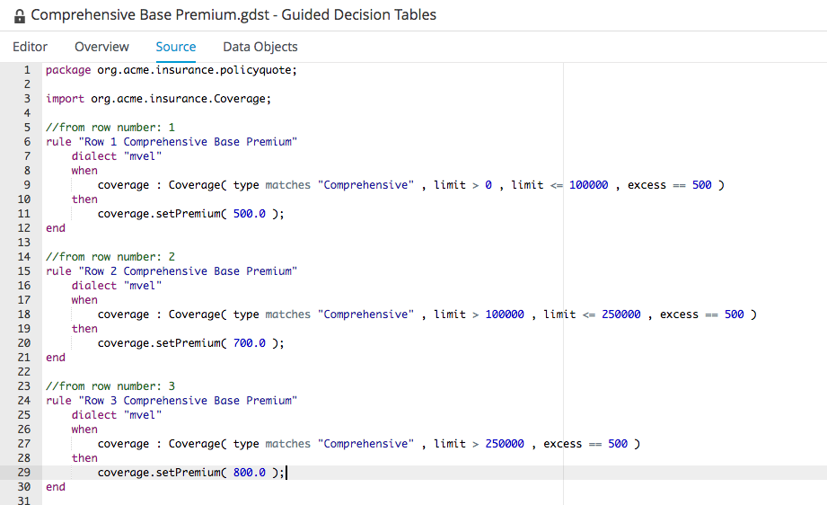 +

== 5. Create Collision Premium Table

1. Create a `Collision` premium table, with the same structure as `Comprehensive` premium table. 
+
NOTE: While it is possible to make a copy of the Comprehensive table above, you are encouraged to create the table from scratch as a practise on the Guided Decision Table editor

2. The completed table should be as follow
+
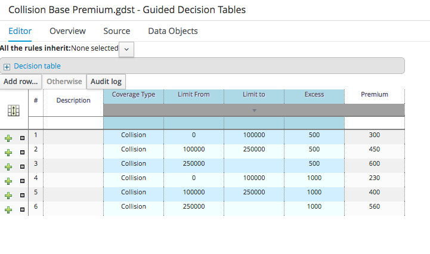 +

== 6. Create Test Scenario

1. Make use of what we've learn from previous labs to create a test scenario for the Comprehensive Base Premium rule. The completed test scenario should be similar to the one shown below:
+
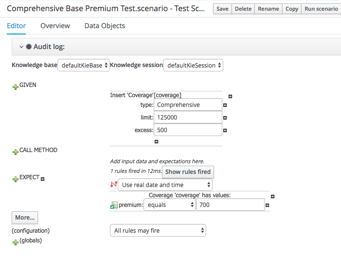 +

