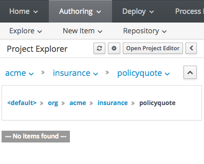
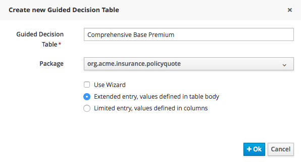

:icons: font
:toc: left

= Lab 7 - Decision Tables

Decision tables are rules presented in a tabulated form, like a spreadsheet. This format is especially useful when needing to create lots of rules that are similar in nature. +
BPM Suite supports decision tables written in a spreadsheet (Excel, OpenOffice), as well as a web-based *Guided Decision Table Editor*. In this lab, you will use the web-based decision table editor to author rules

== Goal

Use the Guided Decision Table to implement decision table rule.

== 1. Create New Decision Table

We will use decision tables to create pricing tables for various types of coverage. The premium for each coverage type will be based on the limit and excess requested.

1. In BPM Suite, navigate to the `org.acme.insurance.policyquote` package.
+
 +

2. Select `New Item -> Guided Decision Table` to create a new decision table with the following inputs:
* Table name : `Comprehensive Base Premium`
* Package : `org.acme.insurance.policyquote`
* Check `Extended entry, values defined in table body`
+
 +

