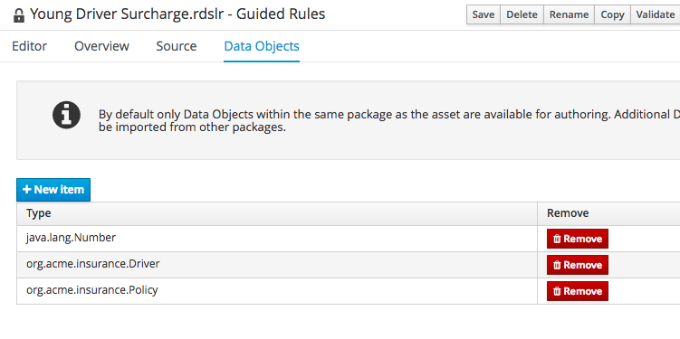
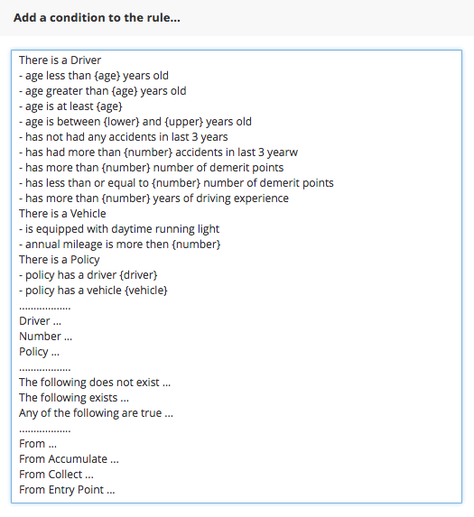
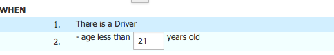
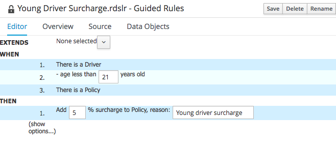

:icons: font
:toc: left

= Lab 8 - Domain Specific Language

Domain Specific Languages in JBoss BPM Suite 6 act as a stylesheet for rules. A DSL enables you to express your rules in a more natural language.

To do so, you need a mapping file that maps technical rule expression fragments to natural language constructs.

== Goals

Learn how to use the `DSL Editor` in BPM Suite, and experience how it can help make if even easier for business users to understand the rules.

== 1. Mapping File 

A DSL mapping file was prepared for you, so you can import this into your project.

1. Open the Projects page of the web based BPM Console by selecting `Authoring → Project Authoring`.

2. In Project Explorer, navigate to the `org.acme.insurance.policyquote` folder.

3. Select `New Item → DSL definition`.

4. In the pop-up window, enter `Acme` as the name of the DSL mapping file.

5. Click `Ok`.

6. Copy the contents of the link:extras/lab8/acme.dsl[`acme.dsl`] and paste it into the DSL editor pane.

7. Examine the DSL mappings.

8. Click `Validate` and then click `Save`.

== 2. Surcharges and Discounts

Now, we will use the DSL to write some rules to get discounts or add surcharges. We will define the following rules:

[cols=4*, options="header,autowidth"]
|===
| | Rule Name | Condition | Action
|1| Young Driver Surcharge | If the driver is less than 21 years old | Add a 5% surcharge
|2| Experienced Driver Discount | If the driver has more than 5 years of driving experience, and has not had any accidents in last 3 years  | Give a 5% discount
|3| Daytime Running Lights Discount | If the vehicle has daytime running lights | Give a $15 discount
|===

=== 2.1 Young Driver Surcharge

1. Select `New Item -> Guided Rule`

2. Fill in the pop-up window as follows
* Guided Rule : `Young Driver Surcharge`
* Package : `org.acme.insurance.policyquote`
* Check `Use Domain Specific Language (DSL)`

3. Select `Data Objects` tab and import `org.acme.insurance.Driver` and `org.acme.insurance.Policy`
+
 +

4. Click on `+` on the `when` line to add condition. Notice that now there are more choices
+
 +

5. Select `There is a Driver` condition.

6. Click on `+` on the same line as `There is a Driver` to bring up the conditions pop-up again. Select `- age less then {age} years old`

7. In the text box, replace `age` with 21.
+
 +

8. Add `There is a Policy` constraint

9. Click on `+` on the `then` line, and add `Add {surchage}% surcharge to Policy, reason: {reason}`. In the text boxes, replace `surcharge` with `5` and `reason` with `Young driver surcharge`.
+
 +

10. Click on `Source` tab to examine the translated rule.

11. Click `Validate` and `Save`

=== 2.2 Create the Discount rules

Create the `Experienced Driver Discount` and `Daytime Running Lights Discount` rules:

[cols=4*, options="header,autowidth"]
|===
| | Rule Name | Condition | Action
|1| Experienced Driver Discount | If the driver has more than 5 years of driving experience, and has not had any accidents in last 3 years  | Give a 5% discount
|2| Daytime Running Lights Discount | If the vehicle has daytime running lights | Give a $15 discount
|===
