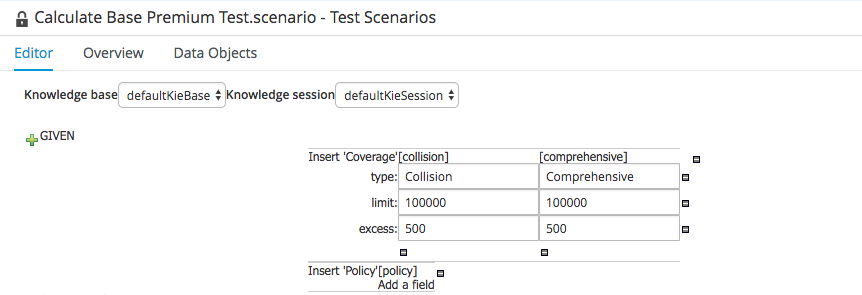
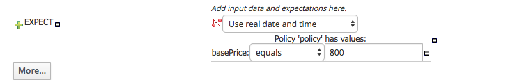

:icons: font
:toc: left

= Lab 9 - Advanced Rules

So far, the rules you expressed in the labs were fairly simple. To solve more complex requirements, the DRL language also allows the expression of higher order logical constructs. For example, a policy may have more than one type of coverage, so you need the ability to capture the sum of the calculated prices of the individual coverage. You can do this in DRL with the `accumulate` function.

== Goal
Learn how to use the `accumulate` language feature

== 1. The `Accumulate` function

1. Go to project authoring perspective. Select `Authoring -> Project Authoring` from the main menu.

2. Select `org.acme.insurance.policyquote` package.

3. Create a new `DRL File`, named `Calculate Base Premium`.

4. Copy and paste the content of this link:extras/lab9/calculate-base-premium.drl[DRL] into the DRL editor.

5. Click `Validate` and `Save`.

6. Examine this DRL 
+
`salience -10`
+
The salience option determines the priority of the rule compared to other rules. This aggregate rule should fire after all the others. Thus it is given a negative salience (the default value is 0; a higher value means higher priority).
+
Recall the syntax for the accumulate function:
+
----
<result pattern>
    from accumulate ( <source pattern>,
        init ( <init code>  ),
        action ( <action code>  ),
        reverse ( <reverse code>  ),
        result ( <result expression>  )
    )
----
+
An explanation of each component of the accumulate function as follows:
+
[cols=2*, options="autowidth"]
|===
|init | The <init code> executes once when the Coverage and Policy objects exist in working memory.
|action | The price value of each coverage that matches the <source pattern> accumulates in the <action code>.
|reverse | The <reverse code> is used only if the facts of the collection of objects for the <source pattern> change before the rule executes.
|result | The result of the <result expression> must satisfy the <result pattern> for this condition of the when clause to be met.
|===

== 2. Test `Accumulate` Rule

Now we test the `accumulate` rule to understand how it behaves.

=== 2.1 Insert Facts
1. Create a new test scenario `Base Premium Test`.

2. From the `Data Object` tab, import `org.acme.insurance.Coverage` and `org.acme.insurance.Policy`.

3. Switch back to `Editor` tab and insert the following facts
+
[cols=2*, options="autowidth,verse"]
|===
| | Facts
|1| Coverage +
type= Collision +
limit= 100000 + 
excess= 500
|2| Coverage +
type= Comprehensive +
limit= 100000 + 
excess= 500
|3| Policy 
|===

4. Once the facts are inserted to the Test Scenario facts table, it should appear as follows:
+
 +

=== 2.2 Define Expected Results
1. Define the expected results as follows:
+
 +

=== 2.3 Execute Test

1. Execute the test by clicking on `Run Scenario`

2. Examine the rules fired.

3. Playaround with different values for `limit` and `excess`, and see the different results.

